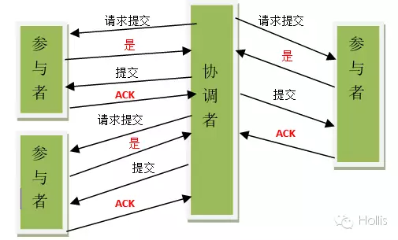
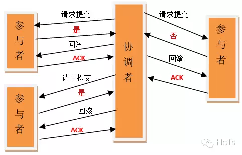
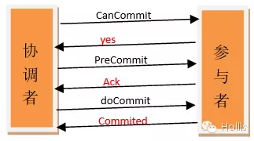

## 10分钟讲解分布式事务，两阶段提交和三阶提交

> 视频介绍什么是分布式事务和实现方案，二阶段提交和三阶段提交协议的实现原理

你好，我是好刚，这一讲我们来了解分布式事务和解决方案：二阶段提交和三阶段提交。

## 分布式事务和方案

首先我们来看看什么是分布式事务，在分布式系统中，为了保证数据的高可用，通常我们会将数据保存多个副本(replica)，这些副本会存储在不同的物理机器上。这就是分布式。为了保证这么多副本数据的一致性，就需要用到分布式事务。

事务是什么，事务是指对数据的一系列操作，要么全部执行，要么全部不执行。那事务的实现步骤是什么样的？

1. 数据库会将要执行的一系列操作先记录成日志
2. 然后逐条执行数据更新操作
3. 如果所有操作成功，就会提交事务；如果有操作出现异常就会根据日志将所有操作回滚。从而达到所有操作要么全部执行要么全部不执行的效果。

分布式事务可以理解为涉及到多个数据库的事务，要同时更新几个不同的数据库。

这里的问题时，多个数据库在物理机上是相互独立的，一台数据库在执行本地事务的时候不知道其他机器中的事务执行情况。为了保持执行一致，解决思路是引入一个“协调者”，由“协调者”统一管理所有参与者的操作。再所有数据库记录日志，执行完数据更新操作后，并不提交而是通知协调者操作"成功"，当协调者收到所有参与者发回的“成功”通知后，就说明所有参与者本地事务都执行成功了，就会通知所有数据库提交（commit）事务，分布式事务执行成功，这是成功的情况。如果在执行过程中，有数据库发回操作“失败”的通知，这个时候就需要所有数据库的所有操作全部不生效，协调者会通知所有数据库根据记录的日志将操作回滚(rollback)，分布式事务也就失败了。

根据”协调者“这一思想，在实现上衍生出了二阶提交协议（Two Phase Commitment Protocol）和三阶提交协议（Three Phase Commitment Protocol）。

## 2PC

先来看下二阶段提交(Two-phaseCommit)，其实二阶段提交是上面讲的“协调者”方式的具体实现，这里的两个阶段分别是：准备阶段和提交阶段。二阶段提交中有一个协调者，和多个事务参入者。

### 准备阶段

首先是准备阶段，这个阶段由协调者开启事务：

1. 协调者向所有参与者发送事务处理请求。
2. 参与者收到请求，开始将操作信息写入日志，并且执行事务操作，但是不提交。
3. 如果事务操作执行成功，则它返回一个"同意"消息；如果执行失败，就返回一个"中止"消息。

### 提交阶段

再协调者收到了所有参与者的响应消息后，就进入了第二个阶段，提交阶段，这个时候协调者根据所有参与者的反馈情况决定下一步操作，这里有两种情况：

情况一：如果所有参与者返回的都是"同意"的话:

1. 协调者就会向所有参与者节点发出"提交(commit)"的请求。
2. 参与者提交事务，释放占用的资源，向协调者节点发送"完成"消息。
3. 分布式事务执行完成。

情况二：我们再来看第二种情况，如果有参与者在执行本地事务时出现异常，返回的消息就不是“同意”而是一个"中止" 消息，这个时候为了保证所有参入者数据一致性，就需要所有参入者将操作撤销：

1. 协调者向所有参与者发出"回滚(rollback)"的请求。
2. 参与者利用之前写入的日志进行回滚操作。
3. 分布式事务执行也就失败。

### 二阶段提交的缺点

二阶段提交，实现分布式事务的原子性操作，但是还是存在缺点：

1. 第一个是协调者存在单点故障，一旦协调者发生故障，那分布式事务无法继续完成操作。
2. 第二个是数据不一致，假设所有参入者本地事务执行成功，协调者向参与者发送提交请求的时候，出现局部网络异常，导致只有一部分参与者接受到了提交请求，但是其他没有接到提交请求的参与者就不会执行事务提交操作，这就会整个分布式系统中就会出现数据不一致性的情况。

那由于二阶段提交存在缺陷，所以在二阶段提交的基础上提出了三阶段提交。

## 3PC

三阶段提交（Three-phase commit），是二阶段提交（2PC）的改进版本，这里的三个阶段是指：预备阶段(CanCommit)，准备阶段(PreCommit)和提交阶段（doCommit）。

### 预备阶段

首先是预备阶段：

1. 协调者开启事务，向参与者发送询问请求
2. 参与者判断自己是否可以顺利执行事务，如果能就返回"同意"响应，并进入预备状态。否则反馈"中止"

### 准备阶段

协调者收到所有响应后，就进入了第二个阶段：准备阶段。

假如所有的参与者反馈的都是"同意"响应，那么事务就会开始执行：

1. 协调者向参与者发送事务执行请求
2. 参与者会将操作记录到事务日志中，执行事务操作。如果操作顺利就返回“同意”给协调者

### 提交阶段

再协调者接收到完参入者的准备阶段响应后，分布式事务就进入了第三个阶段：提交阶段。

再准备阶段，参入者都返回的“同意”响应，就开始执行提交：

1. 协调者向所有参与者发送提交请求
2. 参与者执行事务提交，并且向协调者返回本地事务处理成功消息
3. 协调者接收到所有参与者的响应后，分布式事务也就执行成功了

### 中止事务

这是正常执行的情况，再来看下对异常的处理。这里不管是在第一阶段预备阶段，有参与者没有准备好而返回"中止"消息，还是第二阶段准备阶段中有参与者的本地事务执行失败返回“中止”消息，只要有参与者向协调者发送了“中止”响应，那协调者就会中止事务，并且向所有参与者发送“回滚”请求，接收到请求后，参与者会利用操作日志将所有操作撤销，回到事务开启之前的一致状态。

### 三阶段提交的改进和缺陷

这就是三阶段提交的实现逻辑，我们来看看它是怎么改善二阶段提交的缺陷。

在三阶段提交协议中，一旦进入第三阶段提交阶段，在经过第一阶段预备阶段的询问后，所有参与者具备完成事务的条件，说明大概率所有参入者的本地事务是执行成功的，这个时候不管是发生了协调者故障，还是网络异常导致“提交”请求无法到达参入者，三阶段提交中的参入者在等待超时后会继续将事务提交。这种情况下，如果是二阶段提交，是不会继续执行的，所以三阶段提交改善了出现故障时事务无法完成的问题。

这里三阶段提交也有问题，刚才提交出现故障时所有参与者是选择执行事务提交，如果第二阶段中有某个参与者执行失败返回的中止消息由于网络异常没有到达协调者，就会出现其他所有参与者执行提交而这个参与者执行回滚的情况，整个系统的数据就会不一致，所以三阶段提交改善了二阶段提交的问题，但是都没有完美实现分布式事务。

这种无法完美解决主要是理论上，实际中我们会根据具体业务场景，进行数据补偿和修正，以保证业务数据最终一致，所以我们也不必悲观

## 小结

最后小结一下，这一讲我们了解了分步式事务和他的解决方案，二阶段提交和三阶段提交，希望对你有所帮助，也请你帮忙关注和转发，这个很重要。我是好刚，好钢用在刀刃上，我们下一期视频再见。

## 引用资料

公众号: Hollis Hollis  

https://mp.weixin.qq.com/s/o2Hm-2JdBB-8dSyDYCaqew

http://www.hollischuang.com/archives/681