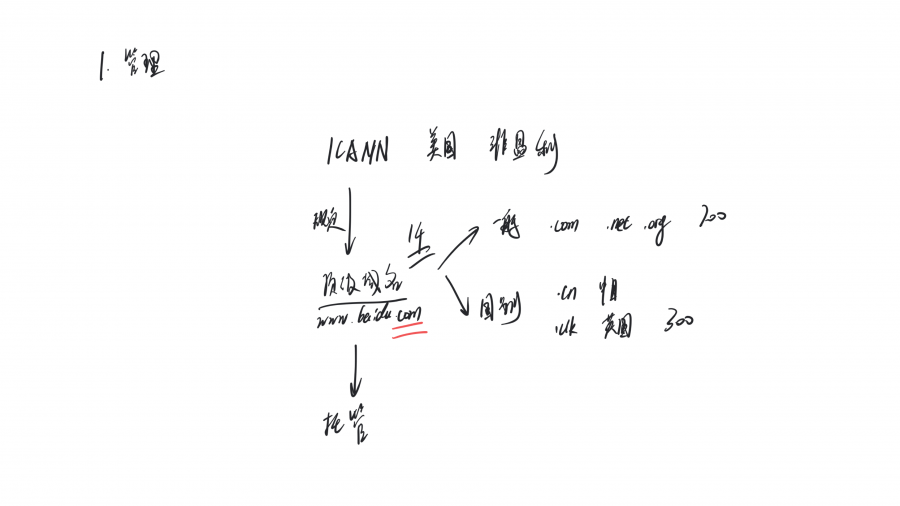
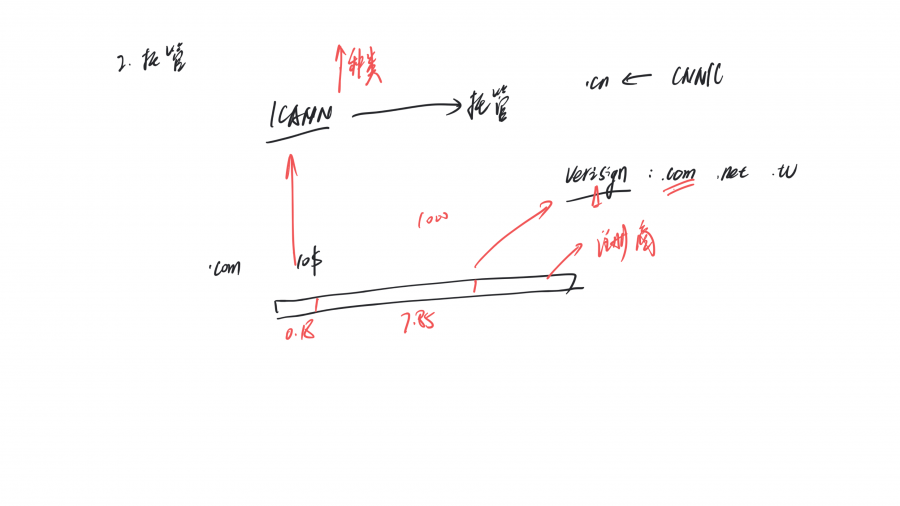
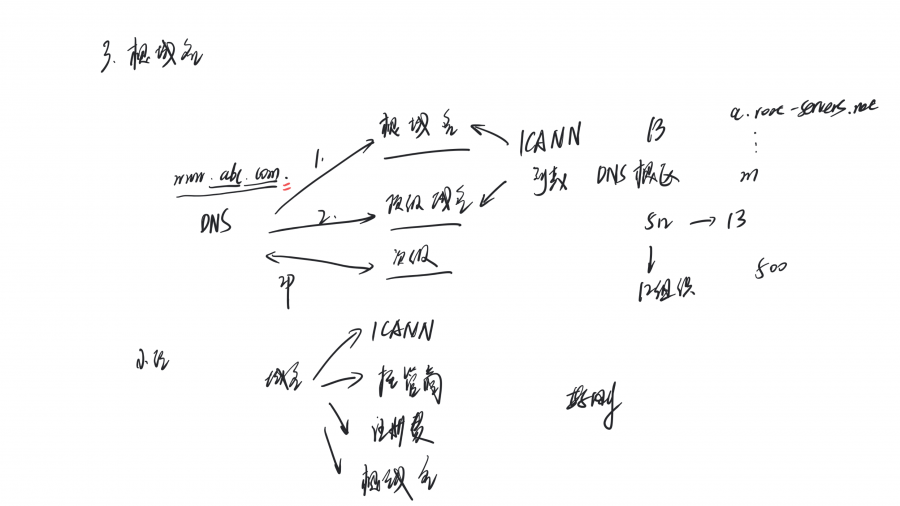
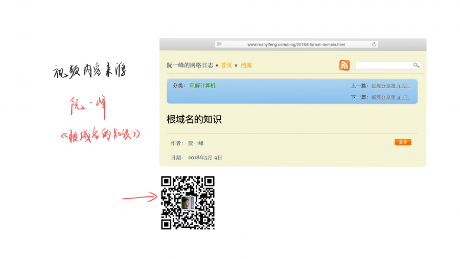

## 8分钟视频讲解根域名的知识

> 视频讲解域名的管理机构和托管方式，弄明白我们购买域名花的钱都交到了哪里

你好，我是好刚，这一讲我们来了解根域名的相关知识。

域名是互联网的基础设施，只要上网就会用到，它还是一门利润丰厚的生意，所有域名每年都必须交注册费，你想想世界上有那么多域名，加起来这是很大的一笔钱。这些钱交了谁，到底谁控制域名的价格？这一讲我们就来了解这些知识。

[>>>点击观看视频讲解](https://www.bilibili.com/video/av37574560/)

先说明下视频的内容来源，这期视频内容来源于阮一峰老师的博客《根域名的知识》，[这是阮一峰的博客](http://www.ruanyifeng.com/blog/)，这是他的公众号，你可以在这里找到更多优秀的文章，建议你关注。

## 1. 管理机构

### ICANN

我们先来看看域名的管理机构，全世界域名的最高管理机构，是一个叫做 ICANN （Internet Corporation for Assigned Names and Numbers）的组织。它的总部在美国加州，原来是美国商务部下面的一个非盈利机构，2016年的时候，不再隶属于美国商务部，成为一个独立机构。

ICANN 负责管理全世界域名系统的运作，它的一项主要工作规定顶级域名（top level domain，简写为 TLD）。

### TLD

所谓顶级域名（TLD），就是最高层级的域名。简单说，就是网址的最后一个部分。比如，网址www.baidu.com 的顶级域名就是.com。ICANN 就负责规定，哪些字符串可以当作顶级域名。

现在顶级域名共有1 千多个，可以分成两类，一类是一般性顶级域名（gTLD），比如.com、.net、.org 等等，大概700多个。

另一类是国别顶级域名（ccTLD），代表不同的国家和地区，比如.cn（中国）、.uk（英国），这种有300多个。

ICANN 再规定顶级域名后，自己不会去管理这些顶级域名，有1000多个，根本管不过来，所以它给每个顶级域名都找了一个托管商，所有事项都交给托管商来负责。

## 2. 顶级域名托管商

### 顶级域名托管商

对于顶级域名托管商，ICANN 将顶级域名交给托管商管理，像`.cn` 域名的托管商就是中国互联网络信息中心（CNNIC），它决定了`.cn` 域名的各种政策。

目前，世界上最大的顶级域名托管商是美国的 Verisign 公司。

### Verisign

前面提到ICANN 是非盈利的，但是Verisign 就是一家商业公司，它托管着.com、.net 、.tv 等等这些顶级域名。2003年的时候，Verisign 卖掉了域名注册业务，只做顶级域名的管理工作。

### 域名注册费用

知道了ICANN 和托管商，现在来看看域名注册费，假设你去注册一个.com 域名，如果域名售价是10 美元，其中0.18 美元是 ICANN 收取的管理费，7.85 美元是 Verisign 收取的托管费，ICANN 和 Verisign 合计拿走8.03美元，其余的钱才是域名注册商的费用。

可以看到Verisign 拿的钱最多，这里ICANN 将.com 域名交给Verisign 管理，让Verisign 获得了巨额垄断利润。不过 ICANN 通过另一种方式在发挥市场的力量，那就是它不断增加顶级域名的种类，如果你觉得.com 域名太贵，那完全可以申请其他的顶级域名，毕竟有 1000 多个顶级域名供你选择。

## 3. 根域名

### 根域名

我是好刚，我们继续看看ICANN 的另外一项工作，那就是根域名。由于 ICANN 管理所有的顶级域名，所以它是最高一级的域名节点，也被称为根域名（root domain）。

有时`www.abc.com` 也可以被写成` www.abc.com.`，最后还会多出一个点，这个点就是根域名，因为所有的域名都有这个点，所以平时使用时被隐藏了。

根域名主要用于DNS 解析，也就是查询域名IP 地址的时候，这里我们来看一下DNS 解析的流程，如果要查询`www.abc.com`的IP 地址，就必须先查询根域名，因为只有根域名才能告诉你，`.com` 这个顶级域名的域名服务器，然后再查询顶级域名服务器，询问`.abc`的次级域名的域名服务器在哪里，最后查询次级域名服务器就能获得域名的IP地址。这里DNS 通过分层查询的方式来获取IP 地址。

ICANN 就维护着一张列表，记载着所有顶级域名服务器地址，这张列表的正式名称叫 DNS 根区（DNS root zone），文件大概 2.2 MB。

### 根域名服务器

保存 DNS 根区文件的服务器，就叫做 DNS 根域名服务器（root name server）。全世界有13 个根域名服务器，编号从a.root-servers.net 一直到m.root-servers.net。为什么是13 台呢？是因为早期的 DNS 查询结果是一个512 字节的 UDP 数据包。这个包最多可以容纳13个服务器的地址，

这13台根域名服务器由12个组织独立运营。这里为了保证根域名服务器的可用性，每个根域名编号下都会部署很多个服务器，所以用于根域名查询的服务器其实不止13台，现在全世界大概是有500 多台根域名服务器。

## 小结

最后做个小结，这一讲我们了解到域名的最高管理机构是ICANN，ICANN 负责规定顶级域名，顶级域名具体由托管商管理；另外我们知道域名注册费分别交给了ICANN，顶级域名托管商和域名注册商；最后了解了根域名的作用。

希望这个讲解对你有所帮助，也请你帮忙关注和转发，这个很重要。我是好刚，好钢编程，让技术更好懂，我们下一期视频再见。

## 引用资料

这个视频的内容来源于阮一峰的博客《根域名的知识》，这是阮一峰的博客，这是他的公众号，你可以在这里找到更多优秀的文章，建议你关注。

参考资料: http://www.ruanyifeng.com/blog/2018/05/root-domain.html

作者： 阮一峰

blog: http://www.ruanyifeng.com/blog/

